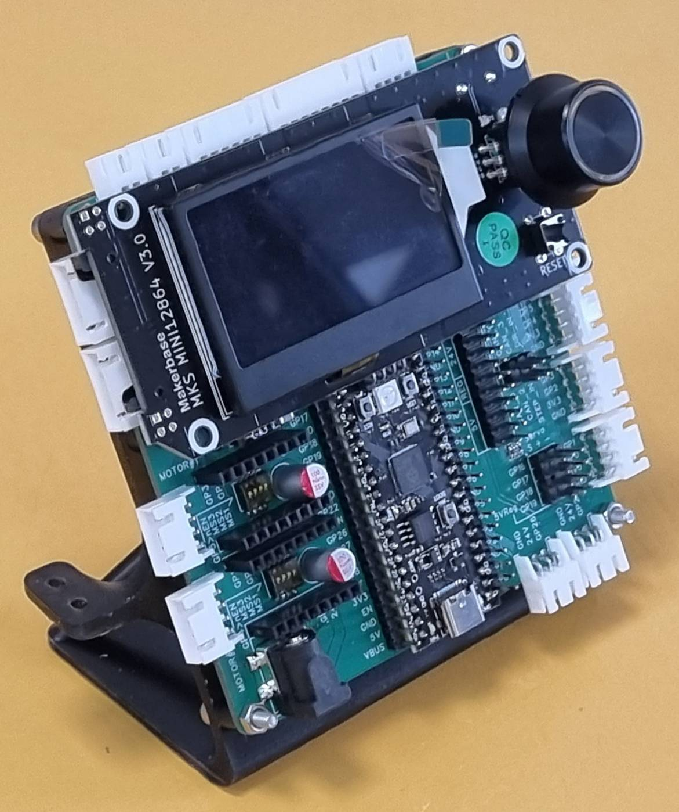
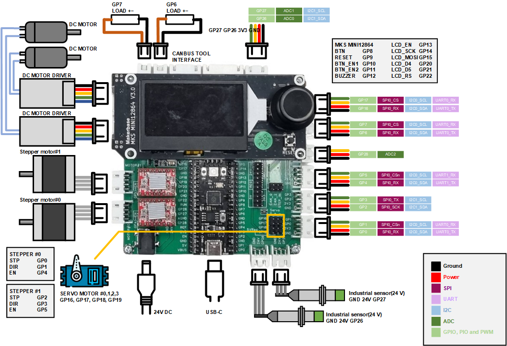

# Pi Interface

This **RP2040-based** mechatronics controller, with the [MKS MINI12864 V3.0](https://github.com/makerbase-mks/MKS-MINI12864-V3) interface, drive circuits, and industrial power supply, supports Python development via **MicroPython** and **CircuitPython**. Python’s extensive libraries enable seamless motion control, sensor integration, and industrial automation. It supports SPI, I2C, UART, PWM, and ADC, allowing precise control of motors, servos, and industrial sensors. The LCD interface provides real-time monitoring, while network integration enables IoT applications. With Python’s ease of use and scalability, this platform is ideal for robotics, CNC systems, and smart manufacturing, bridging academic research with industrial applications.

# Pinout Diagram

# Requirements
To run the provided examples, you'll need to install the following dependencies:
* [ST7567](https://github.com/ChangboBro/ST7567-micropython-framebuff.git)
* [encoderLib](https://github.com/BramRausch/encoderLib.git)
* [picozero](https://github.com/RaspberryPiFoundation/picozero.git)

For installation instructions, follow the [this guide](https://picozero.readthedocs.io/en/latest/gettingstarted.html).

# Hardware details
* [Schematic](hardware/SCH_Pi%20Interface%20V1_0.pdf)
* [CAD](hardware/Pi%20Interface%20V1_0.step)
